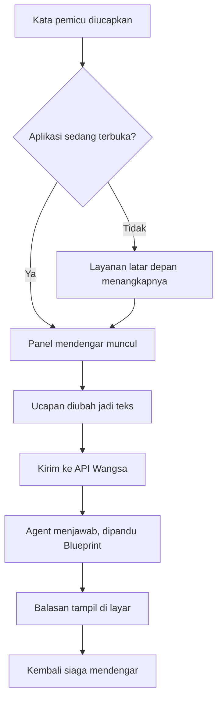
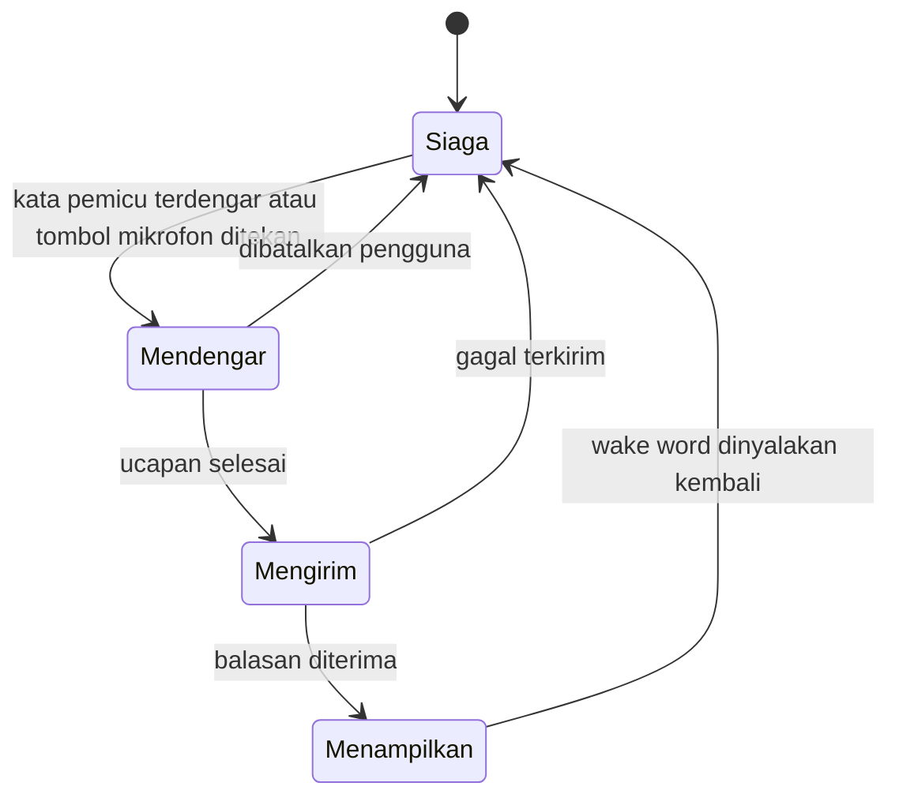
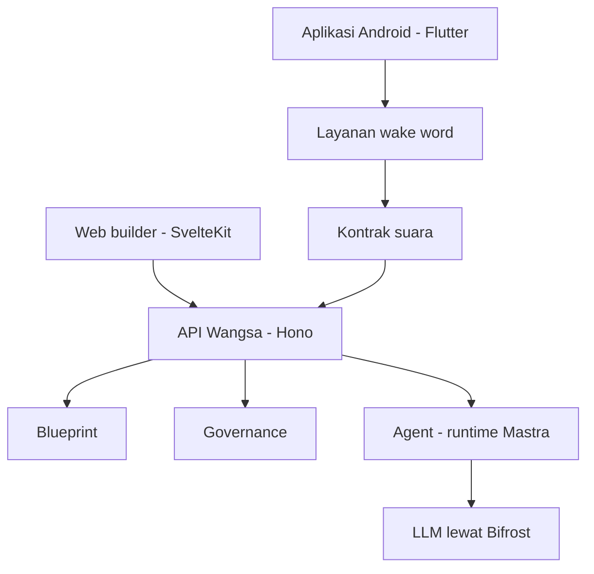

# PRD: Wangsa Mobile Assistant

Versi 1, 12 September 2026. Target demo 20 September 2026.

## Addendum produk, 25 September 2026

Keputusan berikut menggantikan bagian yang bertentangan di bawah ini: layar
default aplikasi adalah chat kosong yang siap dipakai. Sidebar menyediakan
percakapan baru, riwayat percakapan, dan ruang kerja Bangun Agent. Builder
mobile saat ini mengumpulkan brief lalu membukanya sebagai percakapan desain
baru; pembuatan Blueprint, persetujuan, dan publikasi tetap memerlukan API
builder yang belum tersedia. Mode pekerjaan akun + BYOK port 9902 tetap ada
sebagai mode eksplisit, bukan halaman awal.

Dokumen ini fokus pada produk. Alasan teknis di balik pemilihan stack
ada di [`docs/mobile-client-decision.md`](../../docs/mobile-client-decision.md).

## 1. Ringkasan

Wangsa sudah punya alur lengkap dari kebutuhan bahasa natural menjadi
Agent Blueprint, disetujui manusia, lalu dijalankan dan dipublikasikan.
Yang belum ada adalah cara memakai Agent itu dari ponsel.

Aplikasi ini adalah klien Android untuk Agent yang sudah dipublikasikan.
Pengguna membukanya, langsung bicara dengan Agent, dan bisa memanggilnya
dengan kata pemicu tanpa menyentuh layar.

Aplikasi ini **bukan** alat untuk membuat atau menyetujui Agent. Semua
governance tetap di web.

## 2. Pengguna

| Pengguna | Kebutuhan | Permukaan |
|---|---|---|
| Pengguna akhir | Memakai Agent tanpa akun dan tanpa tahu apa itu Wangsa | Aplikasi Android ini |
| Builder | Merancang, menyetujui, dan mempublikasikan Agent | Web, tidak berubah |

## 3. Lingkup 20 September

1. Aplikasi Android terpasang dari berkas APK.
2. Saat dibuka, aplikasi menampilkan satu Agent yang sudah dipublikasikan,
   lengkap dengan nama dan tujuannya.
3. Pengguna bisa mengetik pesan dan menerima balasan dari Agent sungguhan.
4. Pengguna bisa menekan tombol mikrofon, bicara dalam bahasa Indonesia,
   dan ucapannya dikirim sebagai pesan.
5. Pengguna bisa memanggil asisten dengan kata pemicu, termasuk saat layar
   mati, selama layanan latar belakangnya hidup.
6. Agent yang dituju dan alamat API dibaca dari berkas konfigurasi di
   server, sehingga bisa diganti tanpa membangun ulang aplikasi.
7. Ada layar pengaturan kecil untuk menempel id Agent lain saat menguji.

## 4. Alur

Alur pengguna dari kata pemicu sampai balasan.

Mikrofon hanya boleh dipegang satu komponen pada satu waktu, jadi serah
terimanya diatur di satu tempat, yaitu kontrak suara.

Saat status Mendengar, wake word dimatikan lebih dulu. Saat kembali ke
Siaga, wake word dinyalakan lagi. Tanpa aturan ini, dua komponen berebut
mikrofon dan keduanya gagal.

## 5. Di luar lingkup

Ditulis eksplisit supaya tidak jadi harapan yang tidak terucap.

- Login dan akun pengguna.
- Layar builder: membuat Blueprint, menyetujui, mempublikasikan.
- Daftar Agent di dalam aplikasi. Backend sengaja tidak menyediakan
  endpoint untuk itu agar orang luar tidak bisa menebak Agent apa saja
  yang ada.
- Ingatan percakapan lintas sesi. Agent publik memang tidak memilikinya.
- iOS.
- Rilis ke Play Store.
- Membacakan balasan satu per satu lewat tombol "Bacakan" di gelembung chat. Yang ada hanya
  percakapan suara berkelanjutan (lihat bagian mikrofon di atas): balasan atas ucapan
  dibacakan, lalu mikrofon dibuka lagi.

## 6. Kriteria sukses demo

Demo dianggap berhasil bila kelimanya bisa ditunjukkan berurutan pada
satu perangkat.

1. Aplikasi dibuka, nama dan tujuan Agent muncul.
2. Pesan ketik terkirim, balasan Agent muncul.
3. Tombol mikrofon ditekan, ucapan bahasa Indonesia berubah jadi teks dan
   terkirim.
4. Ponsel diletakkan dengan layar mati, kata pemicu diucapkan, panel
   asisten muncul.
5. Berkas konfigurasi di server diubah, aplikasi dibuka ulang, dan Agent
   yang tampil berganti tanpa pemasangan ulang.

## 7. Batas platform yang harus diketahui bersama

Bukan kekurangan tim, melainkan aturan sistem operasi.

- **iOS tidak bisa** mendengarkan kata pemicu di latar belakang.
- **Setelah ponsel dinyalakan ulang**, pengguna harus membuka aplikasi
  sekali. Android 15 melarang layanan mikrofon dinyalakan saat boot.
- **Notifikasi permanen selalu tampil** selama layanan mendengar aktif.
  Itu diwajibkan Android dan tidak bisa disembunyikan.
- **Optimasi baterai harus dimatikan manual** di perangkat demo, karena
  sebagian merek ponsel agresif membunuh layanan latar belakang.
- Pembanding yang adil untuk kualitas wake word adalah aplikasi Alexa di
  Android, **bukan** Gemini. Gemini adalah aplikasi sistem dengan hak
  istimewa dan dibantu perangkat keras audio khusus.

## 8. Stack

Flutter, `flutter_bloc`, `http`, `porcupine_flutter` untuk kata pemicu,
`flutter_foreground_task` untuk layanan latar belakang bertipe mikrofon,
dan `speech_to_text` untuk mengubah suara jadi teks. Tidak memakai
Capacitor dan tidak memakai WebView.

Backend tidak berubah sama sekali. Aplikasi ini hanya memakai dua
endpoint publik yang sudah ada: ambil Agent, dan kirim pesan.

Posisi aplikasi ini di dalam sistem. Hanya kotak mobile yang baru.

## 9. Pembagian kerja

| Bagian | Pemilik | Status ketergantungan |
|---|---|---|
| Aplikasi Flutter, layar, kontrak suara | Bagus (frontend) | Tidak menunggu siapa pun |
| Mesin wake word native dan layanan latar belakang | Tim AI | Diisi di balik kontrak suara |
| Backend dan API | Tim backend | Sudah siap, tidak ada pekerjaan baru |

Kontrak suara sengaja dipisah supaya dua pekerjaan di atas bisa berjalan
paralel tanpa saling menunggu.

## 10. Ketergantungan dan risiko

| Hal | Dampak bila tidak beres | Pemilik |
|---|---|---|
| AccessKey Picovoice | Wake word tidak bisa diuji sama sekali | Bagus |
| Perangkat Android untuk demo | Tidak ada tempat menguji layanan latar belakang | Bagus |
| Satu Agent yang sudah dipublikasikan | Tidak ada lawan bicara di aplikasi | Bagus, lewat web |
| Ponsel demo membunuh layanan latar belakang | Kriteria sukses nomor 4 gagal | Diuji lebih awal |

## 11. Urutan kerja

| Tanggal | Sasaran |
|---|---|
| 12 sampai 13 September | Uji kelayakan wake word di perangkat, proyek Flutter berdiri, layar chat memanggil API sungguhan |
| 14 sampai 15 September | Lapisan suara, tekan mikrofon lalu bicara |
| 16 sampai 17 September | Wake word disatukan, izin, layanan latar depan, panel asisten |
| 18 sampai 19 September | Layar pengaturan, konfigurasi dari server, penanganan galat, uji di perangkat demo |
| 20 September | Demo |

Hal paling berisiko dikerjakan paling awal dengan sengaja. Bila uji
kelayakan pada 13 September gagal, masih tersisa enam hari untuk berputar
arah.
